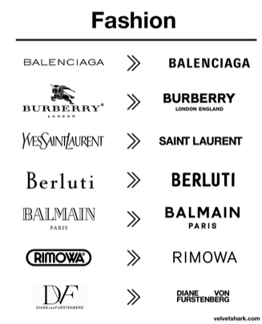
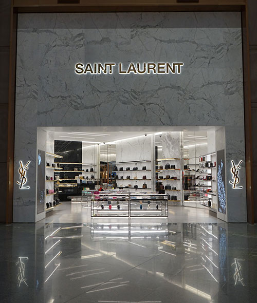
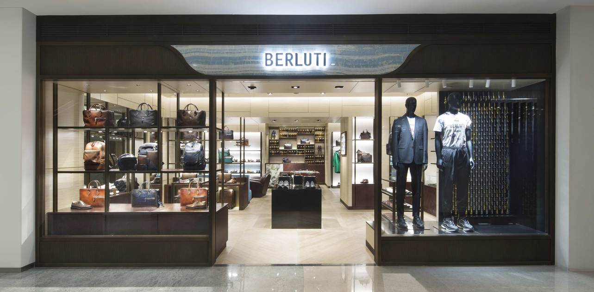

The re-branding of fashion labels over the last few years has sparked a revolution of the use of the sans serif font, leading to the question: why are such established brands simplifying their logos to the point of a seeming lack of personality and character? This article will examine some examples of rebranding and what it means for the company. 

From the above image, we can see multiple examples of the rebranding of designer fashion labels. To dive into the typographical choices and their significance within a brand, we’ll narrow down to individual brands. 

With Yves Saint Laurent, for example, it is clear that they have moved from a script font with light weight and a medium contrast to a heavy weighted, zero contrast sans serif font. The old font has an elegant, sophisticated personality to it, and is an example of the kind of typography one would imagine of when thinking of high fashion. Now, however, the font is bold and rigid, which would be a great choice for a brand to stand out – if it was the only brand to do that, but alas it is not, as many brands have now adopted the same font. 

Berluti’s old logo with the low x-height, monospace/serif font has a quaint, soft feel to it, representing its Italian origin: upon seeing it, I was instantly reminded of boutique stores in the backstreets of Rome. But alike its competitors, it reinvented itself with a heavy-weighted sans serif font, only keeping some originality with the cut-off corners. 

So what are some of the reasons for the sans serif revolution? As put by Sienkiewicz in their article on Velvet Shark*: ‘The purpose of a logo is to be instantly recognizable, different, memorable, and, if possible, to refer to the brand’s values. Blending into everyone else’s achieves none of these things.’ But when we take into account some of the recent changes to the marketing of brands, it is more understandable. With the digital revolution, trends come in and back out at a much faster pace than ever before. With more focus on inclusivity, diversity and breaking down boundaries in fashion, brands must move with the times, and if this requires changing their logo then that is a choice they must make. The sans serif is ‘cleaner and more legible, they are better suited to a variety of media and work particularly well online. The purity of these fonts allows the brands to be an empty vessel, ready to accommodate rapidly shifting trends’. 

To conclude, we can see how sociological changes can affect the pace a brand must move at and how they change their logo according to their changing values and what’s important to the consumer. Font, typeface and style can all give meaning to the values of a brand, and by changing its logo a brand is representing how they are moving away from the past and making a ‘concerted effort’ to ‘prepare for a radically different future’ (Whelan for the BoF website, 2019).

For more excellent insight and analysis on the significance of logo change, may I suggest the websites listed below. 

* https://velvetshark.com/articles/why-do-brands-change-their-logos-and-look-like-everyone-else
* https://www.businessoffashion.com/opinions/luxury/the-revolution-will-not-be-serifised-why-every-luxury-brands-logo-looks-the-same-burberry-balmain-balenciaga