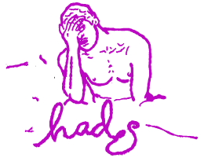

In previous blog posts, we’ve only been talking about brands which are highly mainstream and recognised internationally. It’s time to give some recognition to those smaller, independent brands that are lesser known! 

Independent brands can afford to be a little more creative with their logos. The benefit of being a smaller company means people are more likely to buy the products for the quality, style and uniqueness, rather than just buying the products to show off the brand and the prestige that comes with it, as many people do for famous designer labels. This means the logo doesn’t necessarily have to be neat and sharp and easy to plaster all over products – it can be a bit more creative and free, and gives founders room to create a logo they love, which they can experiment with and make changes to if they become bigger and more known. 
Take adidas, for example. They started out with a complicated sketch and possibly too much writing. Over time, as they got bigger, they polished their logo, but still kept the essence of the stripes and the sans serif font they’re known for. 

In other small, independent brands we can see the same sort of creativity in logos. 

A prime example is Olivia Annabelle.

For her brand , she chose a high contrast, serif font with a fairy-tale feel which is a perfect fit for her brand mantra ‘a slow fashion fairy-tale’. Whilst it’s not a font we are likely to see in top designer brands or high street shops, it is interesting, creative and certainly likely to intrigue someone walking past the shopfront. 

Another great example is Hades, a small independent knitwear company that celebrates the past and embraces the future. Their logo features a cool sketch along with a handwritten style typeface of the brand name, both in a bold colour which is unusual for a clothing brand, giving them an edge.

The logo has an ‘edgy’ feel that is likely to attract younger people interested in streetwear and vintage clothing, which is great for a brand who base their values on the fashion of idols from the past.

It is really interesting to look at small independent brands, and can be a great way to think about what a logo means for different types of brands and how there is no ‘one size fits all’ when it comes to branding.