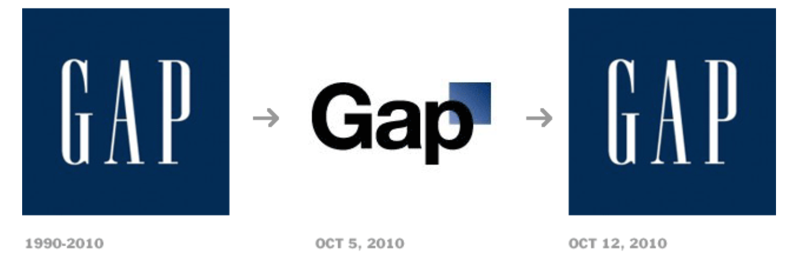

I hope that looking at the other posts on this blog can educate and inspire on some of the features that make a highly effective logo to make a brand the best it can be. But to really see what makes a good logo, we also need to look at what makes a bad one and what to avoid! 

A bad logo is often too loud or bright, complicated or confusing, un-cohesive or just downright inappropriate (see <https://www.plerdy.com/blog/top-40-bad-logos/> for a bit of a laugh)!

Whilst there are not many examples of bad logos in the fashion industry, we can pick out a couple. 

The first example is the well-known clothing company GAP. Gap changed their logo on October 5th 2010, and only a week later on October 12th changed it back again due to such a poor response from customers and critics!  

Whilst the old logo was simple and effective with contrasting colours for boldness and a naroow, high contrast srif font for a xlassic appearnece, the changed logo failed in all aspects.