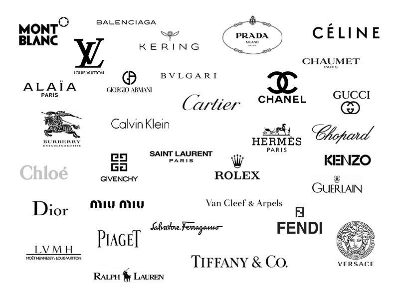
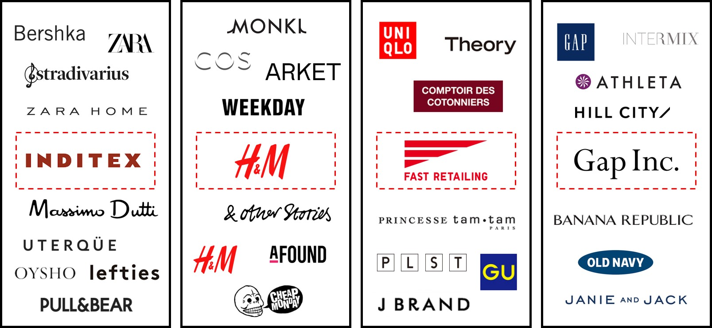

Consumer preference is at the heart of all sales: sales are driven by demand. So what better way to find out what kind of things consumers want to see than by asking them directly?

From carrying out several casual interviews, showing a number of different logos and asking which was the interviewees favourite, why that was and what they thought of and felt when they saw the logo, a good insight into what the public sees as a good logo can be obtained!

I printed out these two images and asked some students which logos they thought were the most effective and why.

I suspected that most of the designer logos would be chosen over high street fashion logos, and the responses confirmed this.

Some comments I got were that upon seeing logos such as Cartier, Guerlain and Tiffany, the viewers immediately thought of elegance, luxury and prestige. In the words of Business student Hannah, the “italic style and script type writing look really fancy and elegant which basically represents the brand perfectly because Cartier is a high-class and prestige jewellery brand”.

Interviewees also said that the Rolex, Piaget and Mont Blanc logos looked really bold and powerful. This is a great point to make as these logos all have features such as width and weight which do make them seem bold, perfectly representing their brand.

When asked which logos they thought were unsuccessful, the general response was Fast Retailing and Gu. The reason for this might be because of the bright colours and sans serif fonts which give the impression of a low-end brand and could unconsciously make the viewer think of lower quality products. Psychology student Jack said “the GU logo is probably one of the worst in my opinion. I just don’t think that bright colours usually work very well for clothing brands because it can look quite tacky”.

It’s great to take away from this interview that different logos all evoke different thoughts and feelings in the viewer than this is specific to each logo and created by typographical features such as weight, width, font, contrast etc. This is a useful tool to know when involved with creating a brand.