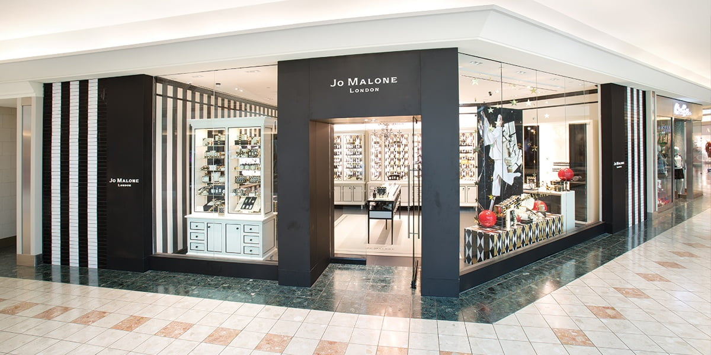

Typographic design in branding is of more importance to us than many understand; when we see a brand’s logo, we associate this with the values, qualities and morals of the brand. The specific font, weight, width and other stylisations of the words written in a brand’s logo are all crafted choices which have meaning in relation to what the company stands for, and what the consumer thinks when they see the logo. In the words of Marty Neumeier (2019), “A brand is a customer’s gut feeling about a product, service or company. A reputation.” Therefore, the way that a company designs its logo is of critical importance to the way in which their audience remembers them.

‘Trends Through the Typeface’ strives to analyse the features of typography within fashion brands. This blog examines the similarities and differences of high-end and low-end fashion brands, the changes within brands over time and the reasons why specific typographic choices were made for that brand. In particular, the focus will be on the way that a brand constructs itself to its audience and why this is so important for the delivery of consumer service throughout dynamic sociological changes.

**My Logo and Banner Image:**

I chose this banner image for my page because I wanted to use a real picture representing an example of the use of typography in our daily life. I specifically chose a shop front because we constantly walk past shop fronts where a company's logo is presented at a large scale and this means the typographical choices are important because it can affect how memorable that brand is to us, and this blog dives into the relationship between the logo, brand and consumer. With text in the banner, it would have looked too clustered, so I left it text-free for a clean-cut appearance.

I chose to use a handwriting style font for my logo to represent how my blog is a casual discussion of what my opinion on some of the features within different typefaces can mean for that brand; I didn't want to choose a more serious font such as serif because my blog is more for light reading for those interested in typography rather than an academic website. The handwriting style is also a font that I could imagine being used by a clothes boutique and as my blog is about the logos of clothing brands I believe this is appropriate. The colour choice is a simple gray scale as most clothing brands use black for their logos so I mirrored this in mine, but just simply using a block shade of black would have been too simple so I used a gradient and inversed this gradient in the text too for a sleek, polished appearance. The 4 T's stand out so give memorability to my brand. Overall, the logo is sleek, polished and memorable, alike many of the clothes brands I discuss in the blog.